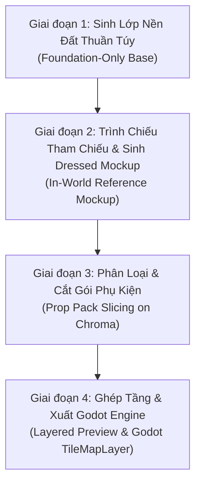

# Map Forge: Quy Chuẩn Sản Xuất Bản Đồ 2D Phân Tầng Chuyên Nghiệp

Kỹ năng này giải quyết triệt để "Cạm bẫy bản đồ dính cứng" (Baked Map Trap) — nơi ảnh tạo bởi AI vẽ dính liền cả nhà cửa, hòm đồ, quái vật lên mặt đất khiến lập trình viên không thể lập trình va chạm (collision), thứ tự hiển thị Y-sorting hay vùng kích hoạt (trigger zones).

---

## 1. Bản Đồ Phân Tầng: 3 Lớp Bất Biến (The 3-Layer Contract)

Mọi bản đồ có thể chơi được (Playable Map) PHẢI tuân thủ hợp đồng phân tầng:

```
[Layer 3: Trigger & Collision] -> StaticBody2D (tường, rào), Area2D (vùng cỏ quái, cửa thoát, chuyển cảnh)
[Layer 2: Y-Sorted Props]     -> Cây cối, cột đèn, tượng, hòm kho báu, cửa (nhân vật đi trước/sau được)
[Layer 1: Foundation Base]    -> NỀN ĐẤT THUẦN TÚY: Cỏ, đường mòn, mặt nước, vách đá thấp (KHÔNG có vật cản cao)
```

> [!IMPORTANT]
> **Hợp đồng Lớp Nền (Foundation-only Base)**:
> Ảnh nền tạo ra đầu tiên TUYỆT ĐỐI KHÔNG ĐƯỢC CHỨA: cây cao, nhà cửa, thùng gỗ, cột cờ, hòm kho báu, cổng thành, quái vật hay nhân vật.
> Nếu ảnh nền sinh ra đã có sẵn các vật thể trên $\rightarrow$ Coi đó chỉ là ảnh Concept, KHÔNG được làm nền runtime. Phải tạo lại lớp nền đất trống!

---

## 2. Quy Trình 4 Giai Đoạn (The 4-Stage Workflow)



### Giai đoạn 1: Sinh Nền Đất Thuần Túy (`<map_name>-base.png`)
- Mô tả địa hình: đồng cỏ xanh, lối mòn đá cuội, dòng sông uốn khúc, góc bờ biển.
- Yêu cầu góc nhìn: Top-down orthographic hoặc 3/4 RPG.
- Tuyệt đối cấm vật thể cao hoặc vật thể tương tác.

### Giai đoạn 2: Quy Trình In-World Reference Mockup Handoff
1. Mở file ảnh nền bằng `view_file` để đưa vào tầm nhìn của phiên làm việc.
2. Yêu cầu mô hình AI: *"Dựa vào ảnh nền đang hiển thị ở trên, hãy giữ nguyên 100% đường cong sông suối, kích thước khung hình và ánh sáng, hãy phác thảo một bản phối cảnh hoàn chỉnh (Dressed Reference) chứa tối đa 9 loại vật thể (cây đại thụ, đèn lồng, hòm gỗ, bia đá, hàng rào) đặt tự nhiên trên nền."*
3. File kết quả là `<map_name>-dressed-reference.png`. Ảnh này dùng làm kim chỉ nam vị trí tọa độ, KHÔNG phải asset game trực tiếp.

### Giai đoạn 3: Phân Loại Phụ Kiện & Cắt Bằng Python
Phân loại vật thể trước khi tạo:
- **Phụ kiện nhỏ/gọn (`compact_prop`)**: Thùng rượu, bụi cỏ, đá nhỏ, đèn đường $\rightarrow$ Gom vào sheet ma trận **`2x2`** hoặc **`3x3`** trên nền Magenta `#FF00FF`.
- **Dải nền ngang (`platform_strip`)**: Cầu gỗ, mép vực, thanh xà side-scroller $\rightarrow$ Tạo dải ngang **`1x3`** (đầu trái, đoạn giữa lặp lại, đầu phải) hoặc **`1x4`**.
- **Công trình lớn / Cao (`tall_or_large_object`)**: Cây cổ thụ, cổng đền, tháp canh $\rightarrow$ Tạo riêng từng ảnh đơn lẻ 1x1 (`one_by_one`).

Chạy công cụ bóc tách prop tự động:
```cmd
cmd /c python catalog\game-studio\tools\extract_prop_pack.py --input <path/to/prop_pack.png> --output-dir <assets/props/name> --rows 3 --cols 3 --sheet-name forest_props
```
Script sẽ tự động:
- Tách nền magenta và khử viền sạch sẽ
- Cắt từng prop thành file PNG trong suốt độc lập: `prop_01.png`, `prop_02.png`, ...
- Xuất file đặc tả metadata JSON: kích thước thực, bounding box và anchor bàn chân.

### Giai đoạn 4: Tổng Hợp Bản Đồ Phân Tầng & Xuất Godot
1. Chạy script ghép lớp kiểm định:
   ```cmd
   cmd /c python catalog\game-studio\tools\compose_layered_preview.py --base <name>-base.png --props-manifest <props_manifest.json> --output <name>-layered-preview.png
   ```
2. Đóng gói cho Godot Engine:
   - File bối cảnh Godot (`.tscn`):
     - `Node2D` (Root)
       - `TileMapLayer` hoặc `Sprite2D` (Base Ground)
       - `YSort` / `CanvasItem.y_sort_enabled = true`
         - `Sprite2D` (Prop 1, position, offset chân)
         - `StaticBody2D` (Vùng va chạm chân prop)
       - `EncounterArea` (`Area2D` vùng đụng độ quái)
       - `ExitArea` (`Area2D` chuyển cảnh)

---

## 3. Bản Đồ Ô Vuông Địa Hình (Terrain Tile Bundles)

Với game chiến thuật theo lượt (Tactical RPG) hoặc bàn cờ ô lưới, sử dụng công cụ bóc tách địa hình:
```cmd
cmd /c python catalog\game-studio\tools\extract_terrain_tiles.py --input <terrain-atlas.png> --output-dir <assets/tilesets/meadow> --rows 2 --cols 3 --terrain-row plain=0 --terrain-row forest=1 --tile-size 128 --strict-qc
```
Script kiểm tra độ tương phản, loại bỏ các ô biến thể trùng lặp và sinh cấu trúc Tileset chuẩn hóa cho Godot `TileSet`.
